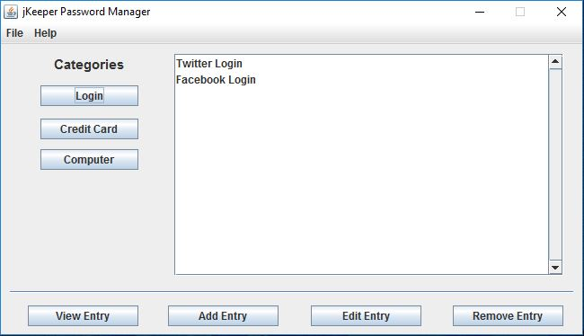
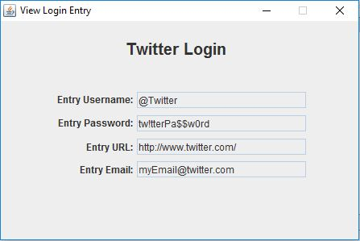

# jKeeper - Desktop Password Manager

jKeeper is a Java desktop application for safely managing all of your private account information.

Maven Dependencies:
- Apache Commons Codec (not currently utilized, will eventually be used for hashing passwords)

